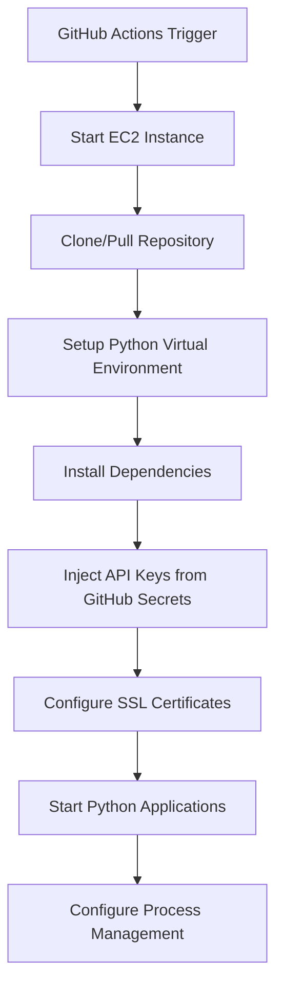

# Design Document

## Overview

This design transforms the crypto robot deployment architecture from Docker-based containerization to direct Python execution on EC2 instances. The new architecture eliminates Docker complexity while maintaining security, reliability, and ease of deployment through git-based deployments and GitHub Actions workflows.

The system will support multiple deployment environments (crypto-robot.local, jack_robot.crypto-vision.com, its_robot.crypto-vision.com) with environment-specific API key injection from GitHub secrets.

## Architecture

### Current State (Docker-based)
- Docker containers for robot and webapp
- Docker image building and registry management
- Container orchestration via docker-compose
- Environment variables passed via base64-encoded ENV_CONTENT
- Certificate mounting and SSL configuration within containers

### Target State (Python-direct)
- Direct Python execution on EC2 instances
- Git-based code deployment and updates
- Virtual environment management for Python dependencies
- Systemd service management for process reliability
- Direct file-based environment configuration with GitHub secret injection

### Deployment Flow


## Components and Interfaces

### 1. GitHub Actions Workflows

#### Updated control-robot-aws.yml
- **Purpose**: Main deployment and management workflow
- **Changes**: 
  - Remove Docker commands (docker run, docker stop, docker pull)
  - Add git clone/pull operations
  - Add Python virtual environment setup
  - Add systemd service management commands
  - Add API key injection from GitHub secrets

#### Removed build-robot-image.yml
- **Rationale**: No longer needed as we're not building Docker images
- **Impact**: Eliminates Docker registry dependencies and build complexity

### 2. Python Application Management

#### Virtual Environment Setup
```bash
# Create virtual environment
python3 -m venv /opt/crypto-robot/venv

# Activate virtual environment
source /opt/crypto-robot/venv/bin/activate

# Install dependencies
pip install -r requirements.txt
```

#### Application Entry Points
- **Robot Mode**: `python main.py --mode robot`
- **WebApp Mode**: `python app.py` or `python main.py --mode web`
- **Both Modes**: Separate systemd services for concurrent execution

### 3. Environment Configuration Management

#### GitHub Secrets Pattern
- **Format**: `<HOST>_KEYS` (e.g., `JACK_ROBOT_CRYPTO_KEYS`)
- **Content**: JSON structure containing Binance API keys
```json
{
  "BINANCE_API_KEY": "actual_api_key_here",
  "BINANCE_SECRET_KEY": "actual_secret_key_here"
}
```

#### Environment File Injection
- Base .env file deployed from repository
- API keys injected from GitHub secrets during deployment
- Other environment variables preserved from base configuration

### 4. Process Management

#### Systemd Services
Two systemd service files for reliable process management:

**crypto-robot.service**
```ini
[Unit]
Description=Crypto Trading Robot
After=network.target

[Service]
Type=simple
User=ec2-user
WorkingDirectory=/opt/crypto-robot
Environment=PATH=/opt/crypto-robot/venv/bin
ExecStart=/opt/crypto-robot/venv/bin/python main.py --mode robot
Restart=always
RestartSec=10

[Install]
WantedBy=multi-user.target
```

**crypto-webapp.service**
```ini
[Unit]
Description=Crypto Robot Web Application
After=network.target

[Service]
Type=simple
User=ec2-user
WorkingDirectory=/opt/crypto-robot
Environment=PATH=/opt/crypto-robot/venv/bin
ExecStart=/opt/crypto-robot/venv/bin/python app.py
Restart=always
RestartSec=10

[Install]
WantedBy=multi-user.target
```

### 5. SSL Certificate Management

#### Certificate Structure
- Certificates stored in `/opt/crypto-robot/certificates/<hostname>/`
- Direct file access instead of container mounting
- Environment-specific certificate selection based on CERTIFICATE parameter

#### Certificate Configuration
```bash
# Certificate paths in .env
SSL_CERT_PATH=/opt/crypto-robot/certificates/${HOSTNAME}/cert.pem
SSL_KEY_PATH=/opt/crypto-robot/certificates/${HOSTNAME}/key.pem
```

## Data Models

### Deployment Configuration
```yaml
deployment:
  environment: string  # crypto-robot.local, jack_robot.crypto-vision.com, etc.
  repository_url: string
  branch: string
  python_version: string
  virtual_env_path: string
  application_path: string
  certificate_hostname: string
  github_secret_name: string
```

### Service Management
```yaml
services:
  - name: crypto-robot
    type: trading_robot
    command: python main.py --mode robot
    enabled: boolean
  - name: crypto-webapp
    type: web_application
    command: python app.py
    enabled: boolean
```

## Error Handling

### Deployment Failures
1. **Git Clone/Pull Failures**
   - Retry mechanism with exponential backoff
   - Fallback to previous working version
   - Clear error reporting in GitHub Actions

2. **Python Environment Setup Failures**
   - Dependency installation error handling
   - Virtual environment recreation on corruption
   - Requirements.txt validation

3. **API Key Injection Failures**
   - Validation of GitHub secret existence
   - JSON format validation for API keys
   - Graceful degradation to simulation mode if keys invalid

4. **Service Start Failures**
   - Systemd service status monitoring
   - Automatic restart policies
   - Log aggregation for debugging

### Runtime Error Handling
1. **Application Crashes**
   - Systemd automatic restart
   - Crash log collection
   - Health check endpoints

2. **Certificate Issues**
   - Certificate validation before service start
   - Fallback to HTTP mode if HTTPS fails
   - Certificate expiration monitoring

## Testing Strategy

### Unit Testing
- Test API key injection logic
- Test environment configuration parsing
- Test service management commands
- Test certificate path resolution

### Integration Testing
- End-to-end deployment testing in staging environment
- Multi-environment deployment validation
- Service startup and shutdown testing
- GitHub Actions workflow testing

### Performance Testing
- Python application startup time comparison with Docker
- Memory usage monitoring without containerization
- Network performance testing for direct execution

### Security Testing
- API key injection security validation
- File permission testing for certificates and environment files
- Process isolation testing
- Network security validation

## Migration Strategy

### Phase 1: Preparation
1. Create new GitHub Actions workflows alongside existing ones
2. Develop Python service management scripts
3. Create systemd service definitions
4. Test API key injection mechanism

### Phase 2: Parallel Deployment
1. Deploy new Python-based system to test environment
2. Validate functionality against Docker-based system
3. Performance and security testing
4. Documentation updates

### Phase 3: Cutover
1. Update production workflows to use Python-based deployment
2. Remove Docker-related files and workflows
3. Update all documentation
4. Monitor production deployment

### Phase 4: Cleanup
1. Remove Docker build infrastructure
2. Clean up unused Docker images and containers
3. Archive Docker-related documentation
4. Final validation and monitoring

## Security Considerations

### API Key Management
- GitHub secrets encryption at rest
- Secure injection during deployment only
- No API keys stored in repository or logs
- Environment-specific key isolation

### File System Security
- Proper file permissions for .env files (600)
- Certificate file permissions (600 for keys, 644 for certs)
- Application directory ownership (ec2-user)
- Log file access controls

### Network Security
- HTTPS enforcement for web applications
- Certificate validation
- Port access controls
- Firewall configuration maintenance

### Process Security
- Non-root execution (ec2-user)
- Process isolation
- Resource limits via systemd
- Log rotation and retention policies