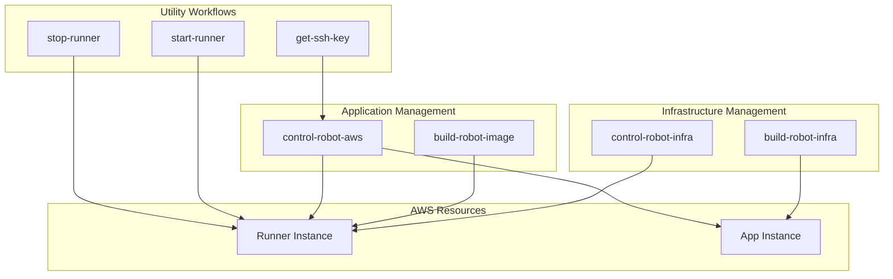

# CI/CD Workflow Guide

## Overview

This comprehensive guide documents all GitHub Actions CI/CD workflows for the crypto trading robot application. The workflows provide complete automation for building, deploying, and managing both infrastructure and application components across development and production environments.

## Architecture Overview

### Two-Instance Architecture

The system uses two separate EC2 instances with distinct purposes:

1. **Runner Instance**: `runner-jmontiel-fr-crypto-robot`
   - **Purpose**: GitHub Actions self-hosted runner
   - **Managed by**: `control-robot-infra` workflow
   - **Used for**: Executing workflow jobs (`runs-on: self-hosted`)

2. **Application Instance**: `web-crypto-robot-instance`
   - **Purpose**: Crypto robot application deployment target
   - **Managed by**: `control-robot-aws` workflow (via SSH)
   - **Used for**: Running the actual crypto robot application

### Workflow Architecture



## GitHub Actions Workflows

### 1. build-robot-image.yml

**Purpose**: Build and push Docker images to DockerHub registry.

**Trigger**: 
- Manual dispatch
- Push to main branch (optional)

**Parameters**:
- `tag` (string, default: "latest"): Docker image tag to use

**Workflow Steps**:
1. Checkout repository code
2. Set up Docker Buildx
3. Login to DockerHub using secrets
4. Build Docker image with certificates
5. Push image to jmontiel/crypto-robot repository
6. Output image metadata and digest

**Usage Example**:
```bash
# Via GitHub UI:
# 1. Go to Actions tab
# 2. Select "Build Robot Image" workflow
# 3. Click "Run workflow"
# 4. Enter tag (e.g., "v1.0.0" or leave default "latest")
# 5. Click "Run workflow"

# Via GitHub CLI:
gh workflow run build-robot-image.yml -f tag=v1.0.0
```

**Required Secrets**:
- `DOCKERHUB_USERNAME`: DockerHub username
- `DOCKERHUB_TOKEN`: DockerHub access token or password

**Outputs**:
- Docker image URL: `jmontiel/crypto-robot:<tag>`
- Image digest for verification
- Build metadata

### 2. build-robot-infra.yml

**Purpose**: Deploy AWS infrastructure using Terraform.

**Trigger**: Manual dispatch

**Parameters**: None (uses default Terraform configuration)

**Workflow Steps**:
1. Checkout repository code
2. Configure AWS credentials
3. Set up Terraform
4. Initialize Terraform backend
5. Plan infrastructure changes
6. Apply Terraform configuration
7. Output infrastructure details

**Usage Example**:
```bash
# Via GitHub UI:
# 1. Go to Actions tab
# 2. Select "Build Robot Infrastructure" workflow
# 3. Click "Run workflow"
# 4. Click "Run workflow" (no parameters needed)

# Via GitHub CLI:
gh workflow run build-robot-infra.yml
```

**Required Secrets**:
- `AWS_ACCESS_KEY_ID`: AWS access key
- `AWS_SECRET_ACCESS_KEY`: AWS secret key
- `AWS_REGION`: AWS region (default: eu-west-1)

**Infrastructure Created**:
- EC2 instance (t3.micro or configured size)
- Security groups with proper ports
- SSH key pair for access
- Elastic IP (optional)
- VPC and networking components

### 3. control-robot-infra.yml

**Purpose**: Start, stop, or check status of AWS EC2 infrastructure.

**Trigger**: Manual dispatch

**Parameters**:
- `action` (choice): "start", "stop", or "status"

**Workflow Steps**:
1. Checkout repository code
2. Configure AWS credentials
3. Set up Terraform
4. Execute terraform/start-stop-ec2.sh script
5. Report EC2 instance status

**Usage Examples**:
```bash
# Start EC2 instance
gh workflow run control-robot-infra.yml -f action=start

# Stop EC2 instance
gh workflow run control-robot-infra.yml -f action=stop

# Check EC2 status
gh workflow run control-robot-infra.yml -f action=status
```

**Required Secrets**:
- `AWS_ACCESS_KEY_ID`: AWS access key
- `AWS_SECRET_ACCESS_KEY`: AWS secret key
- `AWS_REGION`: AWS region

**Actions Available**:
- **start**: Powers on the EC2 instance
- **stop**: Powers off the EC2 instance
- **status**: Reports current instance state and IP address

### 4. control-robot-aws.yml

**Purpose**: Manage crypto robot application on AWS EC2 instance.

**Trigger**: Manual dispatch

**Parameters**:
- `init_env` (boolean, default: false): Initialize environment from GitHub secrets
- `execute_command` (multi-select): Commands to execute on EC2

**Available Commands**:
- `update-robot-image`: Pull and deploy latest Docker image
- `start-robot`: Start trading robot service
- `start-webapp`: Start Flask webapp service
- `create_fresh_portfolio`: Initialize new trading portfolio
- `stop-robot`: Stop trading robot service
- `stop-webapp`: Stop Flask webapp service
- `robot-image-status`: Check Docker container status

**Workflow Steps**:
1. Checkout repository code
2. Configure AWS credentials and SSH
3. Connect to EC2 instance via SSH
4. Initialize environment (if init_env=true)
5. Execute selected commands in order
6. Report command results

**Usage Examples**:

#### Deploy New Version
```bash
# Deploy latest image and restart services
gh workflow run control-robot-aws.yml \
  -f init_env=true \
  -f execute_command=update-robot-image \
  -f execute_command=stop-robot \
  -f execute_command=stop-webapp \
  -f execute_command=start-robot \
  -f execute_command=start-webapp
```

#### Start Services
```bash
# Start both robot and webapp
gh workflow run control-robot-aws.yml \
  -f execute_command=start-robot \
  -f execute_command=start-webapp
```

#### Check Status
```bash
# Check application status
gh workflow run control-robot-aws.yml \
  -f execute_command=robot-image-status
```

#### Initialize Fresh Portfolio
```bash
# Create new portfolio and start services
gh workflow run control-robot-aws.yml \
  -f init_env=true \
  -f execute_command=create_fresh_portfolio \
  -f execute_command=start-robot \
  -f execute_command=start-webapp
```

**Required Secrets**:
- `AWS_ACCESS_KEY_ID`: AWS access key
- `AWS_SECRET_ACCESS_KEY`: AWS secret key
- `EC2_SSH_PRIVATE_KEY`: SSH private key for EC2 access
- `EC2_HOST`: EC2 instance public IP or hostname
- `ENV_AWS_CONTENT`: Base64 encoded .env file for AWS deployment

## Step-by-Step Deployment Guide

### Initial Setup (One-time)

#### 1. Configure GitHub Secrets

Navigate to your GitHub repository → Settings → Secrets and variables → Actions, and add:

```bash
# DockerHub Secrets
DOCKERHUB_USERNAME=your_dockerhub_username
DOCKERHUB_TOKEN=your_dockerhub_token

# AWS Secrets
AWS_ACCESS_KEY_ID=your_aws_access_key
AWS_SECRET_ACCESS_KEY=your_aws_secret_key
AWS_REGION=eu-west-1

# EC2 SSH Access (will be populated after infrastructure creation)
EC2_SSH_PRIVATE_KEY=your_ssh_private_key
EC2_HOST=your_ec2_public_ip

# Application Configuration
ENV_AWS_CONTENT=base64_encoded_env_file_content
```

#### 2. Prepare Environment Configuration

Create your AWS environment file:

```bash
# Create robot/.env-aws with production configuration
FLASK_PORT=5443
FLASK_PROTOCOL=https
FLASK_HOST=0.0.0.0
HOSTNAME=jack.crypto-robot-itechsource.com
CERTIFICATE_TYPE=letsencrypt

BINANCE_API_KEY=your_production_api_key
BINANCE_SECRET_KEY=your_production_secret_key
BINANCE_TESTNET=false

DEBUG=false
LOG_LEVEL=INFO

# Encode for GitHub secret
base64 -w 0 robot/.env-aws
# Copy output to ENV_AWS_CONTENT secret
```

### Full Deployment Process

#### Step 1: Build Docker Image

```bash
# 1. Go to GitHub Actions
# 2. Run "Build Robot Image" workflow
# 3. Use tag "latest" or specific version like "v1.0.0"
# 4. Wait for completion and verify image is pushed to DockerHub
```

#### Step 2: Deploy Infrastructure

```bash
# 1. Run "Build Robot Infrastructure" workflow
# 2. Wait for Terraform to create EC2 instance and security groups
# 3. Note the EC2 public IP from workflow output
# 4. Update EC2_HOST secret with the public IP
# 5. Update EC2_SSH_PRIVATE_KEY secret with the generated SSH key
```

#### Step 3: Deploy Application

```bash
# 1. Run "Control Robot AWS" workflow with:
#    - init_env: true
#    - execute_command: update-robot-image
#    - execute_command: start-robot
#    - execute_command: start-webapp
# 2. Wait for deployment completion
# 3. Verify services are running via robot-image-status command
```

#### Step 4: Verify Deployment

```bash
# Check application status
# Run "Control Robot AWS" workflow with:
# - execute_command: robot-image-status

# Access the application
# https://jack.crypto-robot-itechsource.com:5443
# (or your configured hostname and port)
```

### Ongoing Operations

#### Update Application

```bash
# 1. Build new image with updated tag
gh workflow run build-robot-image.yml -f tag=v1.1.0

# 2. Deploy update
gh workflow run control-robot-aws.yml \
  -f execute_command=update-robot-image \
  -f execute_command=stop-robot \
  -f execute_command=stop-webapp \
  -f execute_command=start-robot \
  -f execute_command=start-webapp
```

#### Restart Services

```bash
# Restart both services
gh workflow run control-robot-aws.yml \
  -f execute_command=stop-robot \
  -f execute_command=stop-webapp \
  -f execute_command=start-robot \
  -f execute_command=start-webapp
```

#### Scale Down/Up Infrastructure

```bash
# Stop EC2 to save costs
gh workflow run control-robot-infra.yml -f action=stop

# Start EC2 when needed
gh workflow run control-robot-infra.yml -f action=start

# Check current status
gh workflow run control-robot-infra.yml -f action=status
```

## Troubleshooting Guide

### Common Issues and Solutions

#### 1. Docker Build Failures

**Symptoms**:
- build-robot-image workflow fails
- "No space left on device" errors
- Certificate copying failures

**Solutions**:
```bash
# Check certificate files exist
ls -la certificates/

# Verify Dockerfile syntax
docker build -f docker/Dockerfile -t test-build .

# Clean up Docker cache
docker system prune -a

# Check DockerHub credentials
docker login -u $DOCKERHUB_USERNAME -p $DOCKERHUB_TOKEN
```

#### 2. Terraform Infrastructure Issues

**Symptoms**:
- build-robot-infra workflow fails
- "Resource already exists" errors
- AWS authentication failures

**Solutions**:
```bash
# Check AWS credentials
aws sts get-caller-identity

# Verify Terraform state
cd terraform
terraform state list

# Force unlock if needed
terraform force-unlock <lock-id>

# Destroy and recreate if corrupted
terraform destroy
terraform apply
```

#### 3. EC2 Connection Issues

**Symptoms**:
- control-robot-aws workflow fails
- SSH connection timeouts
- Permission denied errors

**Solutions**:
```bash
# Verify EC2 is running
gh workflow run control-robot-infra.yml -f action=status

# Check security group rules
# Ensure port 22 (SSH) is open from GitHub Actions IP ranges

# Verify SSH key format
# Ensure EC2_SSH_PRIVATE_KEY secret is properly formatted

# Test SSH connection manually
ssh -i private_key.pem ec2-user@<ec2-ip>
```

#### 4. Application Startup Issues

**Symptoms**:
- Services fail to start
- Port binding errors
- Certificate loading failures

**Solutions**:
```bash
# Check container logs
gh workflow run control-robot-aws.yml -f execute_command=robot-image-status

# Verify environment configuration
# Check ENV_AWS_CONTENT secret is properly base64 encoded

# Test .env file recreation
base64 -d <<< "$ENV_AWS_CONTENT" > test.env
cat test.env

# Check certificate availability
# Ensure certificates exist in Docker image for specified hostname
```

#### 5. GitHub Actions Workflow Issues

**Symptoms**:
- Workflows not triggering
- Permission errors
- Secret access failures

**Solutions**:
```bash
# Check workflow permissions
# Repository Settings → Actions → General → Workflow permissions

# Verify secrets are set
# Repository Settings → Secrets and variables → Actions

# Check workflow syntax
# Use GitHub Actions validator or yamllint

# Review workflow logs
# Actions tab → Select failed workflow → View logs
```

### Debugging Commands

#### Check Infrastructure Status
```bash
# EC2 instance status
gh workflow run control-robot-infra.yml -f action=status

# Application status
gh workflow run control-robot-aws.yml -f execute_command=robot-image-status
```

#### View Application Logs
```bash
# SSH into EC2 and check logs
ssh -i private_key.pem ec2-user@<ec2-ip>
docker logs crypto-robot-container
cat /opt/crypto-robot/logs/app.log
```

#### Test Docker Image Locally
```bash
# Pull and test the deployed image
docker pull jmontiel/crypto-robot:latest
docker run -it --rm \
  -e ENV_CONTENT="$(base64 -w 0 robot/.env)" \
  -e CERTIFICATE="crypto-robot.local" \
  jmontiel/crypto-robot:latest /bin/bash
```

### Performance Monitoring

#### Workflow Execution Times
- build-robot-image: ~5-10 minutes
- build-robot-infra: ~3-5 minutes
- control-robot-infra: ~1-2 minutes
- control-robot-aws: ~2-5 minutes (depending on commands)

#### Resource Usage
- EC2 instance: t3.micro (1 vCPU, 1GB RAM)
- Docker image size: ~500MB-1GB
- Network: Minimal (API calls only)

### Best Practices

#### 1. Workflow Management
- Use descriptive tags for Docker images (v1.0.0, not just latest)
- Test workflows in staging before production
- Monitor workflow execution times and optimize if needed
- Use workflow concurrency limits to prevent conflicts

#### 2. Security
- Rotate GitHub secrets regularly
- Use least-privilege AWS IAM policies
- Enable workflow approval for production deployments
- Monitor workflow logs for sensitive data exposure

#### 3. Cost Optimization
- Stop EC2 instances when not needed
- Use appropriate instance sizes
- Monitor AWS costs and set billing alerts
- Clean up old Docker images from DockerHub

#### 4. Reliability
- Implement retry logic for transient failures
- Use health checks for application monitoring
- Set up alerting for critical workflow failures
- Maintain backup and rollback procedures